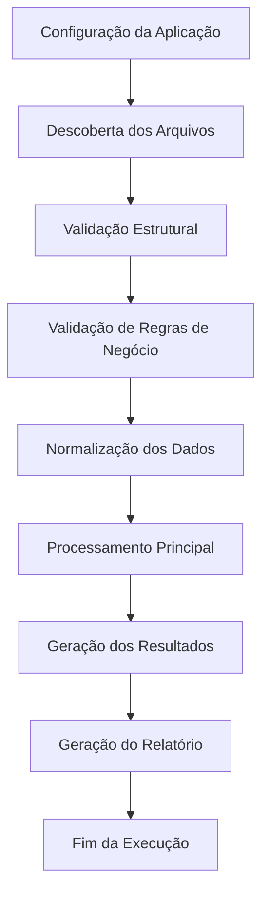
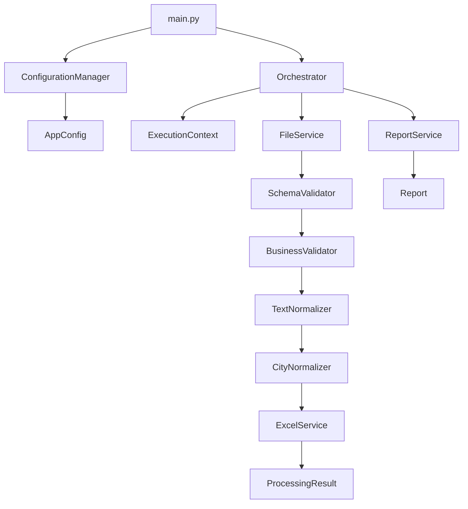

# Pipeline Diagram

## Objetivo

Representar o fluxo operacional completo do processamento realizado pela aplicação.

O objetivo deste diagrama é demonstrar as etapas pelas quais os dados passam desde sua descoberta até a geração do relatório final.

---

## Fluxo de Alto Nível



---

## Fluxo Detalhado



---

## Pipeline Operacional

```text
config.yaml
    ↓
ConfigurationManager
    ↓
AppConfig
    ↓
main.py
    ↓
Orchestrator
    ↓
ExecutionContext
    ↓
Descoberta dos arquivos
    ↓
Validação estrutural
    ↓
Validação de negócio
    ↓
Normalização textual
    ↓
Normalização de cidades
    ↓
Processamento principal
    ↓
Geração dos resultados
    ↓
Geração do relatório
    ↓
Fim da execução
```

---

## Possíveis desvios do fluxo

### Falha na configuração

```text
ConfigurationManager
        ↓
ConfigurationError
        ↓
Encerramento da execução
```

---

### Falha estrutural do arquivo

```text
SchemaValidator
        ↓
FileValidationError
        ↓
Arquivo ignorado ou marcado como falho
```

---

### Violação de regra de negócio

```text
BusinessValidator
        ↓
BusinessRuleError
        ↓
Arquivo ignorado ou marcado como falho
```

---

## Responsabilidade de cada etapa

| Etapa                         | Responsável          |
| ----------------------------- | -------------------- |
| Carregamento da configuração  | ConfigurationManager |
| Representação da configuração | AppConfig            |
| Coordenação da execução       | Orchestrator         |
| Estado da execução            | ExecutionContext     |
| Descoberta dos arquivos       | FileService          |
| Validação estrutural          | SchemaValidator      |
| Validação de negócio          | BusinessValidator    |
| Normalização textual          | TextNormalizer       |
| Normalização de cidades       | CityNormalizer       |
| Processamento principal       | ExcelService         |
| Consolidação dos resultados   | ReportService        |

---

## Características do Pipeline

* Execução sequencial e determinística.
* Separação clara de responsabilidades.
* Baixo acoplamento entre componentes.
* Facilidade para inclusão de novas etapas.
* Facilidade para paralelização futura.
* Suporte para observabilidade e métricas.

---

## Evoluções futuras previstas

A arquitetura permite incorporar facilmente:

* processamento paralelo;
* filas de mensagens;
* retries automáticos;
* processamento distribuído;
* monitoramento em tempo real;
* execução assíncrona;
* múltiplos tipos de arquivos de entrada.

Essas evoluções podem ser adicionadas sem alterações significativas na arquitetura atual.
