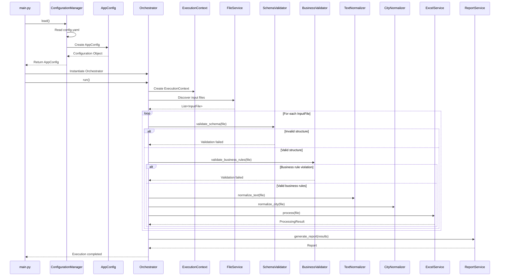

# Sequence Diagram

## Objetivo

Representar a sequência completa de interação entre os componentes da aplicação durante uma execução padrão do sistema.

Este diagrama demonstra:

* ordem de execução dos componentes;
* responsabilidades de cada camada;
* fluxo das dependências;
* criação e compartilhamento do `ExecutionContext`;
* interação entre serviços, validadores e normalizadores.

---

## Fluxo Principal da Aplicação



---

## Fluxo Resumido

```text
main.py
│
├── ConfigurationManager
│
├── AppConfig
│
├── Orchestrator
│
├── ExecutionContext
│
├── FileService
│
├── SchemaValidator
│
├── BusinessValidator
│
├── TextNormalizer
│
├── CityNormalizer
│
├── ExcelService
│
├── ReportService
│
└── Final Report
```

---

## Responsabilidades por etapa

| Etapa                        | Responsável          |
| ---------------------------- | -------------------- |
| Carregamento da configuração | ConfigurationManager |
| Construção da configuração   | AppConfig            |
| Montagem das dependências    | main.py              |
| Coordenação do fluxo         | Orchestrator         |
| Estado da execução           | ExecutionContext     |
| Descoberta dos arquivos      | FileService          |
| Validação estrutural         | SchemaValidator      |
| Validação de negócio         | BusinessValidator    |
| Normalização textual         | TextNormalizer       |
| Normalização de cidades      | CityNormalizer       |
| Processamento principal      | ExcelService         |
| Consolidação dos resultados  | ReportService        |

---

## Decisões arquiteturais representadas

### Composition Root

O `main.py` é o único componente responsável pela criação das dependências da aplicação.

---

### Dependency Injection

Todos os serviços, validadores e normalizadores são fornecidos ao `Orchestrator` via construtor.

---

### Execution Context por execução

Cada chamada ao método `run()` gera um novo `ExecutionContext`.

---

### Separação de responsabilidades

Nenhum serviço executa responsabilidades pertencentes a outro componente.

Cada etapa possui um único responsável definido arquiteturalmente.

---

## Resultado esperado

Ao final da execução, o sistema produz:

* relatório consolidado;
* estatísticas da execução;
* logs operacionais;
* resultados individuais de processamento;
* métricas de sucesso e falha.
